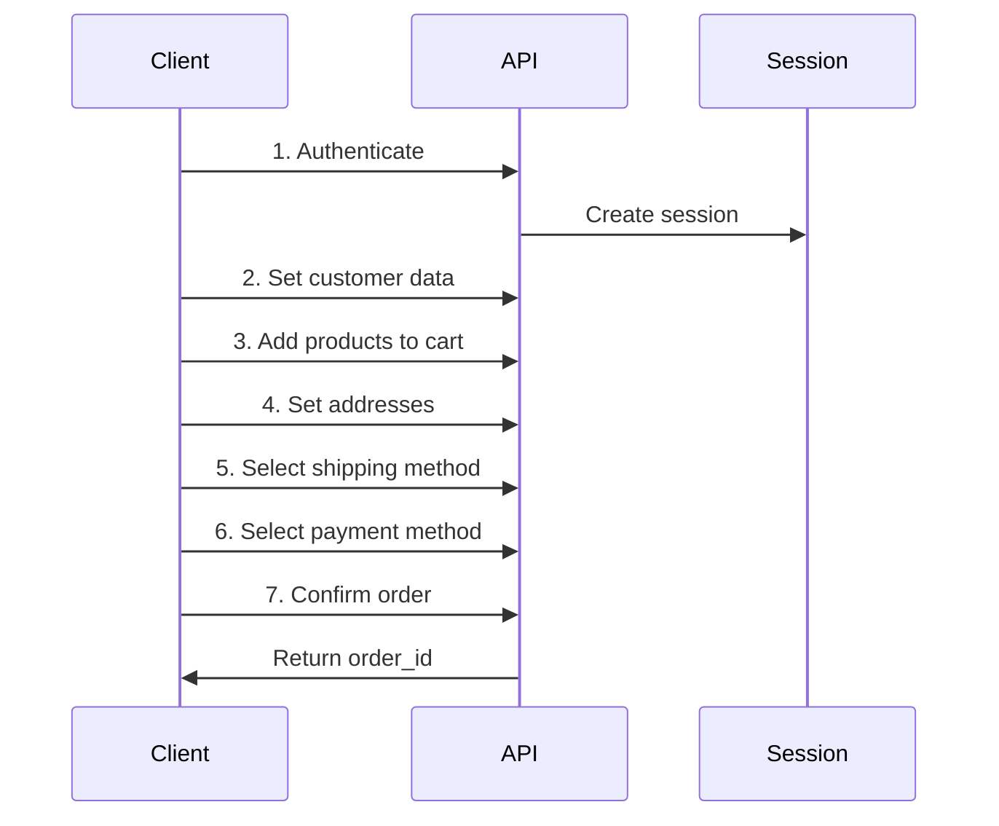

## Introduction

The OpenCart API provides a comprehensive REST-based interface for managing your e-commerce store programmatically. It enables developers to integrate OpenCart with external systems, build custom applications, and automate store operations.

## Base URL

All API requests should be made to:

```
https://your-store.com/index.php?route=api/
```

## API Architecture

The OpenCart API follows a stateful session-based architecture:

1. **Session Management** - API operations maintain session state
2. **Controller-Based** - Each API endpoint is implemented as a controller
3. **JSON Responses** - All responses are returned in JSON format
4. **Validation** - Comprehensive input validation and error handling

## Available API Groups

<CardGroup cols={2}>
  <Card title="Catalog API" icon="box" href="/api/catalog/products">
    Manage products, categories, and manufacturers
  </Card>
  
  <Card title="Sales API" icon="shopping-cart" href="/api/sales/cart">
    Handle cart, orders, customers, and checkout operations
  </Card>
  
  <Card title="Account API" icon="user" href="/api/account/login">
    Manage customer authentication, addresses, and wishlists
  </Card>
  
  <Card title="Localization API" icon="globe" href="/api/localization/currencies">
    Access currencies, countries, and zones data
  </Card>
</CardGroup>

## API Workflow

A typical API workflow for creating an order:



## Response Format

All API endpoints return JSON responses with a consistent structure:

### Success Response

```json
{
  "success": "Operation completed successfully",
  "data": {
    // Response data
  }
}
```

### Error Response

```json
{
  "error": {
    "warning": "General error message",
    "field_name": "Field-specific error message"
  }
}
```

## Key Features

<AccordionGroup>
  <Accordion title="Cart Management">
    Add products, manage quantities, apply discounts, and calculate totals with full support for product options and subscriptions.
  </Accordion>
  
  <Accordion title="Order Processing">
    Complete checkout flow including customer data, addresses, shipping methods, payment methods, and order confirmation.
  </Accordion>
  
  <Accordion title="Catalog Access">
    Retrieve product information, categories, manufacturers, and apply filters for product searches.
  </Accordion>
  
  <Accordion title="Customer Management">
    Handle customer authentication, profile data, addresses, and wishlists.
  </Accordion>
</AccordionGroup>

## Validation

The API includes comprehensive validation:

- **Length Validation** - Using `oc_validate_length()` for string fields
- **Email Validation** - Using `oc_validate_email()` for email addresses
- **Regex Validation** - Custom validation patterns for specific fields
- **Stock Validation** - Automatic stock checking for products
- **Address Validation** - Country and zone validation

<Note>
The API is designed for server-to-server communication. All session data is stored server-side and managed through the session system.
</Note>

## Next Steps

<CardGroup cols={2}>
  <Card title="Authentication" icon="lock" href="/api/authentication">
    Learn how to authenticate API requests
  </Card>
  
  <Card title="Error Handling" icon="triangle-exclamation" href="/api/errors">
    Understand error codes and handling
  </Card>
  
  <Card title="Cart API" icon="cart-shopping" href="/api/sales/cart">
    Start with cart operations
  </Card>
  
  <Card title="Orders API" icon="receipt" href="/api/sales/orders">
    Learn order management
  </Card>
</CardGroup>

## Code Examples

View complete examples in our API guides:

- [Adding Products to Cart](/api/sales/cart#add-product)
- [Creating an Order](/api/sales/orders#confirm-order)
- [Managing Addresses](/api/account/addresses#add-address)
- [Retrieving Products](/api/catalog/products#get-product)