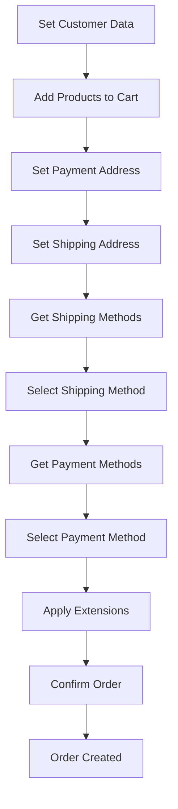

## Overview

The Checkout API represents the complete workflow for processing orders through OpenCart. It orchestrates customer data, cart management, address validation, shipping and payment method selection, and order confirmation.

## Checkout Workflow

The checkout process follows a sequential workflow:



## Step-by-Step Checkout

### Step 1: Set Customer Information

Establish customer identity and contact information.

```php
$customer_data = [
    'customer_id' => 0,  // 0 for guest
    'customer_group_id' => 1,
    'firstname' => 'John',
    'lastname' => 'Doe',
    'email' => 'john@example.com',
    'telephone' => '555-1234',
    'custom_field' => []
];

$response = $this->load->controller('api/customer', $customer_data);
```

<Note>
Customer data must be set first as it's validated in subsequent steps.
</Note>

### Step 2: Add Products to Cart

Add one or more products with options and subscriptions.

```php
$product_data = [
    'product_id' => 42,
    'quantity' => 1,
    'option' => [
        5 => 12  // Size: Large
    ],
    'subscription_plan_id' => 0
];

$response = $this->load->controller('api/cart/addProduct', $product_data);
```

### Step 3: Set Payment Address

Provide billing address information.

```php
$payment_address = [
    'payment_firstname' => 'John',
    'payment_lastname' => 'Doe',
    'payment_company' => '',
    'payment_address_1' => '123 Main Street',
    'payment_address_2' => 'Apt 4B',
    'payment_city' => 'New York',
    'payment_postcode' => '10001',
    'payment_country_id' => 223,  // United States
    'payment_zone_id' => 3655,    // New York
    'payment_custom_field' => []
];

$response = $this->load->controller('api/payment_address', $payment_address);
```

### Step 4: Set Shipping Address

Provide delivery address (required for physical products).

```php
$shipping_address = [
    'shipping_firstname' => 'John',
    'shipping_lastname' => 'Doe',
    'shipping_company' => '',
    'shipping_address_1' => '123 Main Street',
    'shipping_address_2' => 'Apt 4B',
    'shipping_city' => 'New York',
    'shipping_postcode' => '10001',
    'shipping_country_id' => 223,
    'shipping_zone_id' => 3655,
    'shipping_custom_field' => []
];

$response = $this->load->controller('api/shipping_address', $shipping_address);
```

<Warning>
Shipping address is required only if cart contains physical products (hasShipping() returns true).
</Warning>

### Step 5: Get Shipping Methods

Retrieve available shipping options based on cart and address.

```php
$response = $this->load->controller('api/shipping_method/getShippingMethods');

if (isset($response['shipping_methods'])) {
    foreach ($response['shipping_methods'] as $shipping) {
        foreach ($shipping['quote'] as $quote) {
            echo $quote['name'] . ': ' . $quote['text'];
        }
    }
}
```

### Step 6: Select Shipping Method

Choose a shipping method from available options.

```php
$shipping_data = [
    'shipping_method' => [
        'name' => 'Flat Shipping Rate',
        'code' => 'flat.flat',
        'cost' => 5.00,
        'tax_class_id' => 9
    ]
];

$response = $this->load->controller('api/shipping_method', $shipping_data);
```

### Step 7: Get Payment Methods

Retrieve available payment options.

```php
$response = $this->load->controller('api/payment_method/getPaymentMethods');

if (isset($response['payment_methods'])) {
    foreach ($response['payment_methods'] as $payment) {
        echo $payment['name'];
    }
}
```

### Step 8: Select Payment Method

Choose a payment method.

```php
$payment_data = [
    'payment_method' => [
        'name' => 'Cash On Delivery',
        'code' => 'cod'
    ]
];

$response = $this->load->controller('api/payment_method', $payment_data);
```

### Step 9: Apply Extensions (Optional)

Apply coupons, vouchers, or reward points.

```php
// Apply coupon
$coupon_data = ['coupon' => 'SUMMER2024'];
$response = $this->load->controller('extension/opencart/api/coupon', $coupon_data);

// Apply reward points
$reward_data = ['reward' => 100];
$response = $this->load->controller('extension/opencart/api/reward', $reward_data);
```

### Step 10: Confirm Order

Finalize and create the order.

```php
$confirm_data = [
    'order_id' => 0,
    'order_status_id' => 1,
    'comment' => 'Please deliver between 9 AM - 5 PM',
    'affiliate_id' => 0
];

$this->request->post = $confirm_data;
$this->request->get['call'] = 'confirm';

$response = $this->load->controller('api/order');

if (isset($response['success'])) {
    echo 'Order ID: ' . $response['order_id'];
}
```

## Complete Checkout Example

```php
class ApiCheckout {
    private $session_id;
    
    public function processCheckout($order_data) {
        // Initialize session
        $this->initializeSession();
        
        try {
            // Step 1: Customer
            $this->setCustomer($order_data['customer']);
            
            // Step 2: Cart
            $this->addProducts($order_data['products']);
            
            // Step 3: Payment Address
            $this->setPaymentAddress($order_data['payment_address']);
            
            // Step 4: Shipping Address
            if ($this->cartHasShipping()) {
                $this->setShippingAddress($order_data['shipping_address']);
                
                // Step 5-6: Shipping Method
                $shipping_methods = $this->getShippingMethods();
                $this->selectShippingMethod($shipping_methods[0]);
            }
            
            // Step 7-8: Payment Method
            $payment_methods = $this->getPaymentMethods();
            $this->selectPaymentMethod($payment_methods[0]);
            
            // Step 9: Extensions (optional)
            if (!empty($order_data['coupon'])) {
                $this->applyCoupon($order_data['coupon']);
            }
            
            // Step 10: Confirm
            $result = $this->confirmOrder($order_data['comment']);
            
            return [
                'success' => true,
                'order_id' => $result['order_id'],
                'total' => $result['totals']
            ];
            
        } catch (Exception $e) {
            return [
                'success' => false,
                'error' => $e->getMessage()
            ];
        }
    }
    
    private function setCustomer($data) {
        $response = $this->load->controller('api/customer', $data);
        
        if (isset($response['error'])) {
            throw new Exception('Customer validation failed');
        }
    }
    
    private function addProducts($products) {
        foreach ($products as $product) {
            $response = $this->load->controller('api/cart/addProduct', $product);
            
            if (isset($response['error'])) {
                throw new Exception('Product validation failed');
            }
        }
    }
    
    private function setPaymentAddress($data) {
        $response = $this->load->controller('api/payment_address', $data);
        
        if (isset($response['error'])) {
            throw new Exception('Payment address validation failed');
        }
    }
    
    private function setShippingAddress($data) {
        $response = $this->load->controller('api/shipping_address', $data);
        
        if (isset($response['error'])) {
            throw new Exception('Shipping address validation failed');
        }
    }
    
    private function confirmOrder($comment = '') {
        $data = [
            'order_id' => 0,
            'order_status_id' => 1,
            'comment' => $comment
        ];
        
        $this->request->post = $data;
        $this->request->get['call'] = 'confirm';
        
        $response = $this->load->controller('api/order');
        
        if (isset($response['error'])) {
            throw new Exception('Order confirmation failed');
        }
        
        return $response;
    }
}

// Usage
$checkout = new ApiCheckout();

$order_data = [
    'customer' => [
        'firstname' => 'John',
        'lastname' => 'Doe',
        'email' => 'john@example.com',
        'telephone' => '555-1234'
    ],
    'products' => [
        ['product_id' => 42, 'quantity' => 1]
    ],
    'payment_address' => [
        'payment_firstname' => 'John',
        'payment_lastname' => 'Doe',
        'payment_address_1' => '123 Main St',
        'payment_city' => 'New York',
        'payment_postcode' => '10001',
        'payment_country_id' => 223,
        'payment_zone_id' => 3655
    ],
    'shipping_address' => [
        'shipping_firstname' => 'John',
        'shipping_lastname' => 'Doe',
        'shipping_address_1' => '123 Main St',
        'shipping_city' => 'New York',
        'shipping_postcode' => '10001',
        'shipping_country_id' => 223,
        'shipping_zone_id' => 3655
    ],
    'comment' => 'Please deliver in the morning'
];

$result = $checkout->processCheckout($order_data);
```

## Validation at Each Step

<AccordionGroup>
  <Accordion title="Customer Validation">
    - First name (1-32 characters)
    - Last name (1-32 characters)
    - Valid email format
    - Telephone (3-32 characters)
    - Valid customer group
    - Required custom fields
  </Accordion>
  
  <Accordion title="Cart Validation">
    - Product exists and is active
    - Sufficient stock quantity
    - Minimum quantity met
    - Required options provided
    - Valid subscription plan
  </Accordion>
  
  <Accordion title="Address Validation">
    - Names (1-32 characters each)
    - Address (3-128 characters)
    - City (2-128 characters)
    - Valid country and zone
    - Postcode (if required by country)
  </Accordion>
  
  <Accordion title="Method Validation">
    - Shipping method available for address
    - Payment method available for order
    - Methods match available options
  </Accordion>
  
  <Accordion title="Order Confirmation">
    - Customer data exists
    - Cart has products
    - Cart has stock
    - Payment address set (if required)
    - Shipping address set (if required)
    - Shipping method set (if required)
    - Payment method set
  </Accordion>
</AccordionGroup>

## Session Management

All checkout data is stored in the session:

```php
// Session structure
$this->session->data = [
    'customer' => [...],          // Customer information
    'payment_address' => [...],   // Billing address
    'shipping_address' => [...],  // Delivery address
    'shipping_method' => [...],   // Selected shipping
    'payment_method' => [...],    // Selected payment
    'currency' => 'USD',          // Currency code
    'affiliate_id' => 0           // Affiliate tracking
];
```

<Warning>
Maintain the same session across all API requests. Session data is required for order confirmation.
</Warning>

## Digital Products

For digital/downloadable products without shipping:

1. Skip shipping address step
2. Skip shipping method selection
3. Only payment address and payment method required

```php
if (!$this->cart->hasShipping()) {
    // Skip shipping steps
} else {
    // Include shipping steps
}
```

## Error Handling Strategy

```php
function processCheckoutWithErrorHandling($data) {
    $steps = [
        'customer' => 'api/customer',
        'cart' => 'api/cart/addProduct',
        'payment_address' => 'api/payment_address',
        'shipping_address' => 'api/shipping_address',
        'shipping_method' => 'api/shipping_method',
        'payment_method' => 'api/payment_method'
    ];
    
    $errors = [];
    
    foreach ($steps as $step_name => $controller) {
        $response = $this->load->controller($controller, $data[$step_name]);
        
        if (isset($response['error'])) {
            $errors[$step_name] = $response['error'];
            break;  // Stop on first error
        }
    }
    
    if (empty($errors)) {
        // All steps successful, confirm order
        return $this->confirmOrder();
    } else {
        return ['error' => $errors];
    }
}
```

## Next Steps

<CardGroup cols={2}>
  <Card title="Cart API" icon="cart-shopping" href="/api/sales/cart">
    Manage cart products
  </Card>
  
  <Card title="Orders API" icon="receipt" href="/api/sales/orders">
    Order management details
  </Card>
  
  <Card title="Customers API" icon="user" href="/api/sales/customers">
    Customer data handling
  </Card>
  
  <Card title="Addresses API" icon="location-dot" href="/api/account/addresses">
    Address management
  </Card>
</CardGroup>